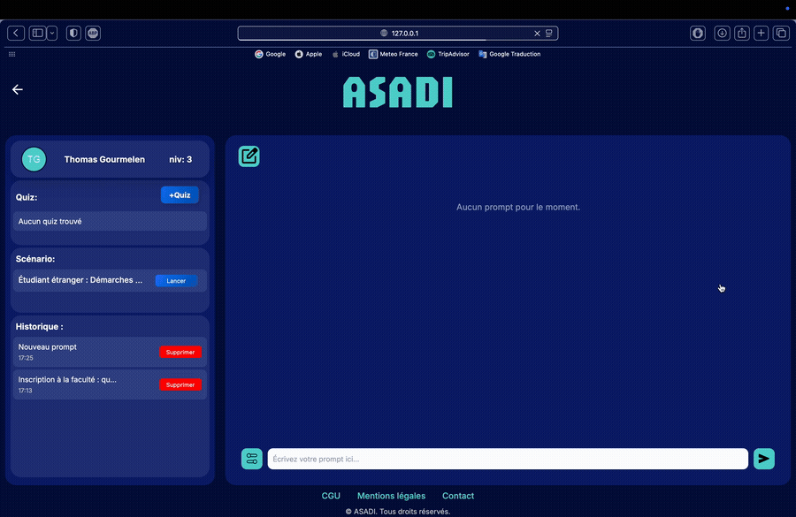

# ASADI - AI-Powered Educational Assistant

[](https://www.python.org/)
[](https://www.djangoproject.com/)
[]()

**[Version française](README.fr.md)**

## 🎥 Presentation Video

[](https://youtu.be/R9_37XSuseA)

*Click on the gif above to watch the project presentation video*

> **Bachelor's Degree Final Project** - Computer Science
> 
> This project is a final year project for a Bachelor's degree in Computer Science, demonstrating the integration of modern AI technologies with traditional web development frameworks.

## Table of Contents

- [Overview](#overview)
- [Key Features](#key-features)
- [Architecture](#architecture)
- [Technologies](#technologies)
- [Installation](#installation)
- [Usage](#usage)
- [Project Structure](#project-structure)
- [Documentation](#documentation)
- [Version Control](#version-control)
- [Contributing](#contributing)

## Overview

**ASADI** (AI-Assisted System for Document Intelligence) is an intelligent educational platform built with Django that leverages advanced AI technologies to provide contextual assistance to students and educators. The system implements a **RAG (Retrieval-Augmented Generation)** architecture using **ChromaDB** as a vector database and integrates with modern **Large Language Models (LLMs)** to deliver accurate, context-aware responses.

The platform allows users to interact with educational documents through natural language queries, while offering advanced features such as quiz generation, scenario-based learning, and workspace management for organizing educational content.

## Key Features

### AI-Powered Conversational Interface
- **RAG System**: Combines semantic search with generative AI for accurate responses
- **Vector Database**: Uses ChromaDB for efficient document embedding storage and retrieval
- **LLM Integration**: Powered by OpenAI's GPT models via LlamaIndex
- **Context Filtering**: Workspace-based filtering to provide relevant contextual responses

### Document Management
- Upload and organize educational documents (PDF, Word, etc.)
- Automatic document chunking and vectorization
- Multi-workspace organization for different courses or topics
- Document versioning and tracking

### Prompt & Conversation History
- Save and manage conversation threads
- Review past interactions and their context
- Share prompts between users
- Export conversation history

### Quiz Generation & Assessment
- AI-powered quiz creation from document content
- Multiple question types support
- Automatic grading and feedback
- Progress tracking and performance analytics

### Scenario-Based Learning
- Create interactive learning scenarios
- Guided question-and-answer sequences
- Student progress tracking
- Feedback and evaluation system

### User Management
- Role-based access control (Students, Educators, Administrators)
- Custom user authentication backend
- User activity tracking
- Profile management

### Workspace Organization
- Create dedicated workspaces for different subjects
- Associate documents with specific workspaces
- Filter AI responses based on workspace context
- Collaborative workspace sharing

## Architecture

ASADI follows a modern **Model-View-Template (MVT)** architecture with additional AI components:

```
┌─────────────────┐
│   User Interface│
│   (Templates)   │
└────────┬────────┘
         │
┌────────▼────────┐
│  Django Views   │
│   & URLs        │
└────────┬────────┘
         │
    ┌────┴────┬──────────────┬──────────────┐
    │         │              │              │
┌───▼────┐ ┌─▼──────┐ ┌────▼─────┐ ┌─────▼──────┐
│ Models │ │  RAG   │ │ ChromaDB │ │ LLM (GPT)  │
│        │ │ Engine │ │ (Vector) │ │ LlamaIndex │
└────────┘ └────────┘ └──────────┘ └────────────┘
```

### RAG Pipeline
1. **Document Ingestion**: Documents are uploaded and processed
2. **Chunking**: Documents are split into semantic chunks
3. **Embedding**: Chunks are converted to vector embeddings using Sentence Transformers
4. **Storage**: Embeddings are stored in ChromaDB
5. **Query Processing**: User queries are embedded and matched against stored vectors
6. **Context Retrieval**: Relevant chunks are retrieved based on similarity
7. **Response Generation**: LLM generates contextual responses using retrieved chunks

## Technologies

### Backend
- **Django 5.2** - Web framework
- **Python 3.8+** - Programming language
- **SQLite** - Relational database (development)
- **ChromaDB** - Vector database for embeddings

### AI & Machine Learning
- **LlamaIndex** - LLM orchestration framework
- **OpenAI GPT** - Large Language Model
- **Sentence Transformers** - Text embedding models
- **all-mpnet-base-v2** - Embedding model
- **LangChain** - LLM application framework

### Frontend
- **HTML5 / CSS3** - Markup and styling
- **JavaScript** - Client-side interactivity
- **Bootstrap** - Responsive design framework

### Additional Tools
- **BeautifulSoup4** - HTML parsing
- **NLTK** - Natural language processing
- **httpx** - Async HTTP client

## Installation

### Prerequisites
- Python 3.8 or higher
- pip (Python package manager)
- Git
- Virtual environment tool (venv or virtualenv)

### Setup Instructions

1. **Clone the repository**
```bash
git clone https://github.com/thmsgo18/asadi.git
cd asadi
```

2. **Create and activate a virtual environment**
```bash
# On macOS/Linux
python3 -m venv venv
source venv/bin/activate

# On Windows
python -m venv venv
venv\Scripts\activate
```

3. **Install dependencies**
```bash
pip install -r requirements.txt
```

4. **Configure environment variables**
```bash
# Create a .env file in the project root
cp .env.example .env
# Edit .env with your configuration (API keys, database settings, etc.)
```

5. **Apply database migrations**
```bash
python manage.py makemigrations
python manage.py migrate
```

6. **Create a superuser (admin)**
```bash
python manage.py createsuperuser
```

7. **Collect static files**
```bash
python manage.py collectstatic
```

8. **Run the development server**
```bash
python manage.py runserver
```

The application will be available at `http://127.0.0.1:8000/`

### ChromaDB Setup

The vector database will be automatically initialized on first document upload. The database is stored in the `chroma_db/` directory.

## Usage

### For Students
1. **Register/Login** to your account
2. **Browse available workspaces** to access course materials
3. **Ask questions** using the prompt interface
4. **Take quizzes** generated from course content
5. **Complete scenarios** for guided learning

### For Educators
1. **Create workspaces** for your courses
2. **Upload documents** (lecture notes, PDFs, etc.)
3. **Generate quizzes** automatically from content
4. **Create scenarios** for interactive learning
5. **Monitor student progress** and performance

### For Administrators
1. **Manage users** and permissions
2. **Configure workspaces** and documents
3. **Monitor system usage** and performance
4. **Access admin panel** at `/admin`

## Project Structure

```
ASADI/
├── ASADI/                  # Main Django configuration
│   ├── settings.py         # Project settings
│   ├── urls.py             # URL routing
│   ├── views.py            # Global views
│   └── static/             # Static files (CSS, JS)
├── documents/              # Document management app
│   ├── models.py           # Document models
│   ├── views.py            # Document views
│   └── utils.py            # Document utilities
├── prompts/                # Conversation management
│   ├── models.py           # Prompt/Question/Response models
│   └── views.py            # Chat interface views
├── quiz/                   # Quiz management
│   ├── models.py           # Quiz models
│   ├── views.py            # Quiz views
│   └── questions/          # Question templates
├── scenario/               # Scenario-based learning
│   ├── models.py           # Scenario models
│   └── views.py            # Scenario views
├── utilisateurs/           # User management
│   ├── models.py           # Custom user model
│   ├── backends.py         # Authentication backend
│   └── views.py            # User views
├── workspace/              # Workspace management
│   ├── models.py           # Workspace models
│   └── views.py            # Workspace views
├── src/                    # AI/RAG core functionality
│   ├── api.py              # LLM API integration
│   ├── reponse.py          # Response generation
│   ├── ingererDonnee.py    # Document ingestion
│   ├── split.py            # Document chunking
│   └── extractions.py      # Data extraction utilities
├── chroma_db/              # Vector database storage
├── documentation/          # Project documentation
│   ├── Cahier des charges.pdf
│   ├── Manuel d'utilisation.pdf
│   ├── Manuel d'installation.pdf
│   ├── Conception détaillée.pdf
│   ├── Rapport de tests.pdf
│   └── Rapport final.pdf
├── media/                  # User-uploaded files
├── manage.py               # Django management script
└── requirements.txt        # Python dependencies
```

## Documentation

Comprehensive documentation is available in the `documentation/` directory:

- **Cahier des charges.pdf** - Project specifications and requirements
- **Manuel d'utilisation.pdf** - User manual
- **Manuel d'installation.pdf** - Installation guide
- **Conception détaillée.pdf** - Detailed design documentation
- **Rapport de tests.pdf** - Testing report
- **Rapport final.pdf** - Final project report
- **Technique.pdf** - Technical documentation
- **Cahier de recette.pdf** - Acceptance testing documentation

## Authors

- [Thomas Gourmelen](https://github.com/thmsgo18)
- [Ali Traore](https://github.com/Taliii7)
- [Valentin Ponnoussamy](https://github.com/Yvngval)
- [Malik Djaffer Abdel](https://github.com/malik439)

---

**For more information, please refer to the comprehensive documentation in the `documentation/` directory.**
